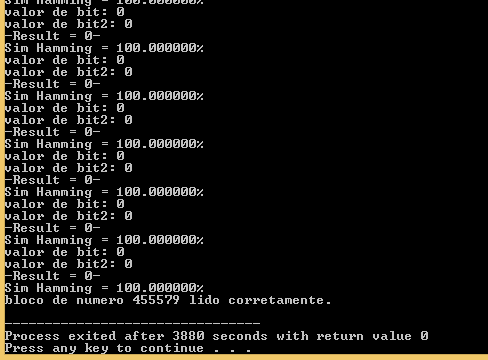
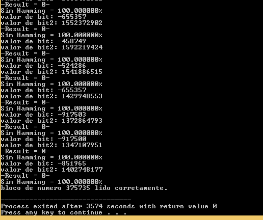
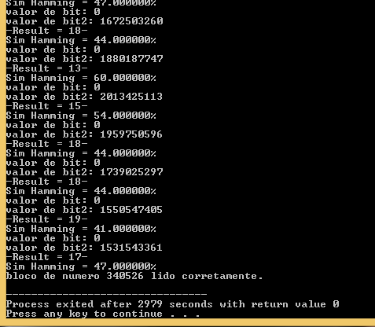

# 1 - um arquivo wav, fazer uma copia e comparar (tem que dar 100% vai em tudo)

o teste realizado concluiu com media final de 100% de similaridade.

Musicas utilizadas:
    - D.B._Ricapito_-_So_Crazy

# 2 - pega 2 musicas, wav, aleatorias

o teste realizado concluiu com 76.931534% de media final de similaridade.

Musicas utilizadas:
    - The_Devil_Music_Co._-_Head_Over_Heels
    - D.B._Ricapito_-_So_Crazy

# 3 - duas musicas, wav, "parecidas" (duas vers�es da mesma m�sica)

o teste realizado concluiu com 76.743423% de media final de similaridade.

Musicas utilizadas:
    - Meduza, Alok - Piece Of Your Heart (Alok Remix) ft. Goodboys
    - Meduza, Goodboys - Piece Of Your Heart (Visualizer) ft. Goodboys